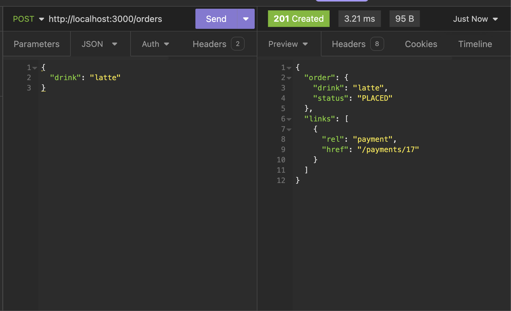
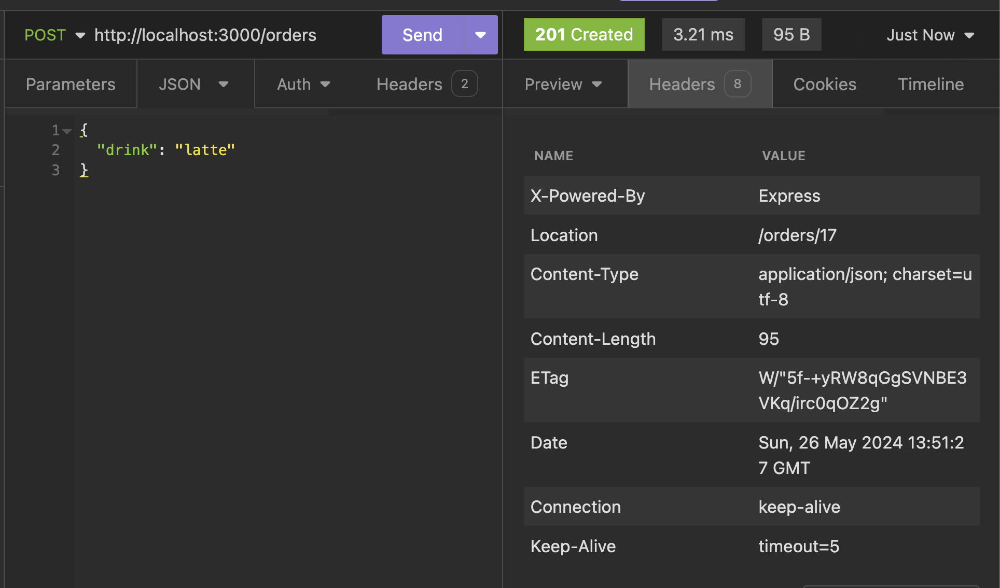

# Starbucks API

An imaginary API to order coffee from Starbucks.

This is a fun project to study RESTful principles and in particular Hypermedia As The Engine Of Application State (HATEOAS). All the code is directly inspired by this very interesting article: https://www.infoq.com/articles/webber-rest-workflow.

## Resource creation

To create a resource, the client issues a POST request on the relevant resource endpoint. For example `POST` on `/orders` to create a new order. If the resource creation is successful, the server indicates this with a `201 Created` response code, and uses the `Location` HTTP header to let the client know where the created resource is located (for example in this case, `/order/{orderId}`). Interestingly, this means including the `id` of the created resource in the JSON body of the response isn't necessary (maybe it's even bad practise, if strictly following HATEOAS?).

The response should also include links to other resources which are necessary for the client to progress. This is a key principle of HATEOAS, and it means that in theory, the client doesn't need to know which endpoints the API exposes in advance: it will discover them as it progresses through the different states. In this case after creating an order, we get a link with `rel: payment` and its corresponding URL (`/payments/{paymentID}`), which we'll be able to query with an `OPTIONS` request to figure out what to do next.

