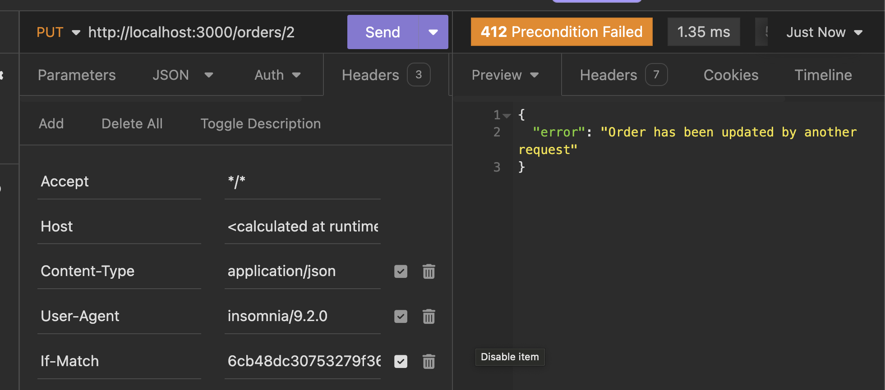

# Starbucks API

An imaginary API to order coffee from Starbucks.

This is a fun project to study RESTful principles and in particular Hypermedia As The Engine Of Application State (HATEOAS). All the code is directly inspired by this very interesting article: https://www.infoq.com/articles/webber-rest-workflow.

## Resource creation

To create a resource, the client issues a POST request on the relevant resource endpoint. For example `POST` on `/orders` to create a new order. If the resource creation is successful, the server indicates this with a `201 Created` response code, and uses the `Location` HTTP header to let the client know where the created resource is located (for example in this case, `/order/{orderId}`). Interestingly, this means including the `id` of the created resource in the JSON body of the response isn't necessary (maybe it's even bad practise, if strictly following HATEOAS?).

The response should also include links to other resources which are necessary for the client to progress. This is a key principle of HATEOAS, and it means that in theory, the client doesn't need to know which endpoints the API exposes in advance: it will discover them as it progresses through the different states. In this case after creating an order, we get a link with `rel: payment` and its corresponding URL (`/payments/{paymentID}`), which we'll be able to query with an `OPTIONS` request to figure out what to do next.

## Using OPTIONS to find out what we're allowed to do

One key idea with REST and HATEOAS is that the client can ask the server what actions it can perform on a resource by issuing an OPTIONS request.

For example after creating an order, the client can send an `OPTIONS` request to the URL that was returned in the `Location` header. The server's response will include an `Allow` header listing all the HTTP methods that are available on the resource **in its current state**. This is a key idea that took me a while to understand with REST: it's not about allowing certain HTTP methods on **endpoints**, it's meant to be much more dynamic, with HTTP methods becoming available or unavailable on **resources** depending on the state of that particular resource.

In our case, if the order hasn't already been picked up by the barista, there's still time to amend it (by asking for extra shot of coffee for example): in this case, the server will reply with `Allow: GET, PUT`. Otherwise, it will reply with `Allow: GET`.

## Updating an order and handling conflicts

Once placed, an order can still be updated by the customer (for example, to request an extra shot of coffee or some caramel etc.). But the order can also be updated by the barista, who might start preparing it and therefore changing its status.

This is a good example of where a REST API should deal with conflicts gracefully. For this example API, every resource has an `ETag` (Entity Tag) which uniquely identifies the current version of the resource (it's just a hash of the last update date, to keep things simple). The `Etag` is sent to clients in the `ETag` HTTP header when they get the resource.

If a client wants to update a resource, the `PUT` request must include an `If-Match` header with the `Etag` of the resource that the client knows about. The server must compare this with the actual current ETag and if they don't match, it means another request has updated the resource. The server replies with `409 Conflict`, and the client should retry the whole process (`GET`ting a fresh copy of the resource and then updating it).

